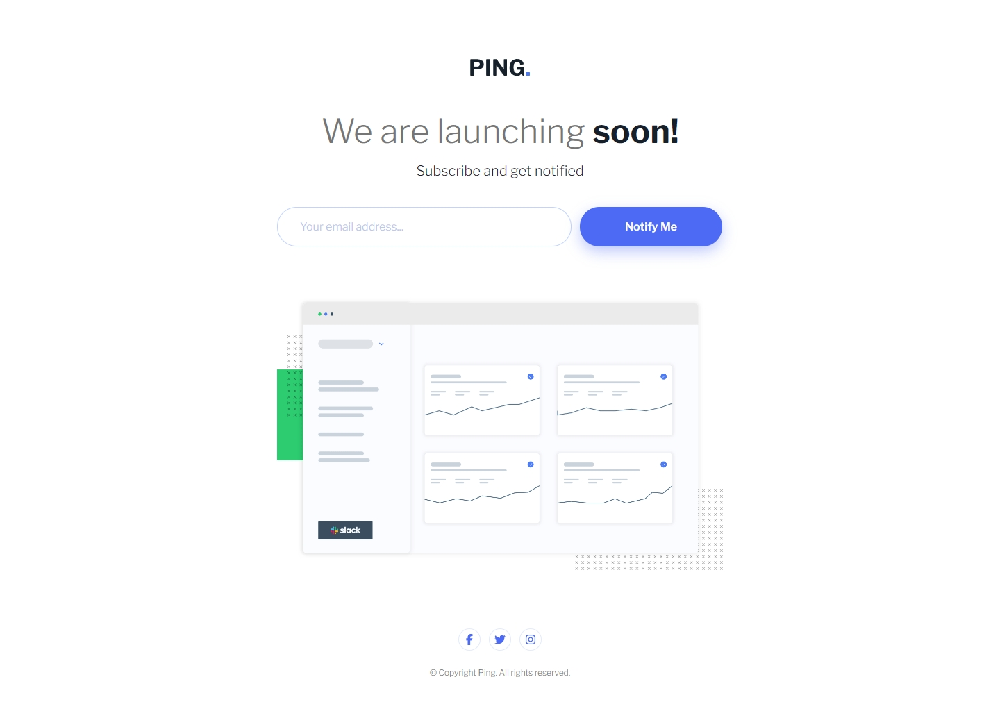
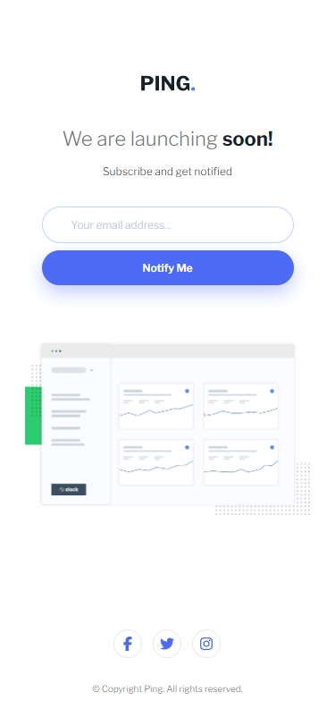

## Frontend Mentor Challenge 11 - Ping Single Column Coming Soon Page

This is my solution to the [Ping Single Column Coming Soon Page](https://www.frontendmentor.io/challenges/ping-single-column-coming-soon-page-5cadd051fec04111f7b848da) challenge on [Frontend Mentor](https://www.frontendmentor.io/).

### Screenshots of My Solution (Desktop & Mobile) 🔍

#

### Links 🔗

- Live Site URL: https://ping-single-column-coming-soon-page-darkstarxdd.vercel.app/
- Solution URL:

#

### Features 🎉

- Client-side Form Validation with Zod 📄
- Mobile Responsive 📱
- Self-hosted Fonts 🔡

#

### Built with 🔧🔨

- JavaScript 🎲
- Zod Validation Library ❗
- Vite 🌠
- Mobile First Approach 📱

#

### New Things I Learned 🎓📖

- Client-side form validation
- How to use the Zod library
- About build tools like Webpack & Vite
- How Vite handles assets
- Clarified some things about npm
- Accessibility concerns related to forms
- Some important ARIA attributes

#

### Helpful Resources 📜

- [MDN Docs - Client-side Form Validation](https://developer.mozilla.org/en-US/docs/Learn/Forms/Form_validation)
- [Zod Documentation](https://zod.dev/)
- [Vite Documentation - Vite Asset Handling](https://vitejs.dev/guide/assets.html)

#

### Tools I Use 🔧

- [Prettier VS Code Extension](https://marketplace.visualstudio.com/items?itemName=esbenp.prettier-vscode) - Code formatter.

- [Responsively.app](https://responsively.app/) - A free and open source tool that allows you to test your webpage on different screen sizes, take screenshots and much more.

- [Color Contrast Checker by coolors.co](https://coolors.co/contrast-checker/112a46-acc8e5) - Check color contrast ratios and if needed, update the colors to match the WCAG guidelines.

- [google webfonts helper by Mario Ranftl](https://gwfh.mranftl.com/fonts) - Converts TTF fonts to WOFF and WOFF2 formats.

- [PerfectPixel by WellDoneCode](https://chromewebstore.google.com/detail/perfectpixel-by-welldonec/dkaagdgjmgdmbnecmcefdhjekcoceebi) - A chrome extension that enables you to overlay an image, over a webpage. This makes it easier to compare your solution result with the reference image and adjust fine details if needed.

#

- My Frontend Mentor Profile - [@DarkstarXDD](https://www.frontendmentor.io/profile/DarkstarXDD)
